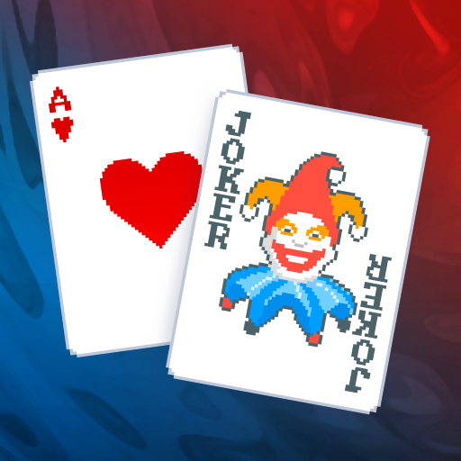

<!-- LOGO -->
<br />
<h1>
<p align="center">
  
  <br>Balatro RL Agent
</h1>
  <p align="center">
    A Reinforcement Learning Agent that learns to play Balatro using deep learning.
    <br />
    </p>
</p>
<p align="center">
  <a href="#overview">Overview</a> •
  <a href="#how-it-works">How It Works</a> •
  <a href="#credits">Credits</a>
</p>  

## Overview

This project creates an AI agent that learns to play and beat Balatro by:

- Injecting Lua code into the Love2D game engine using the Lovely Injector mod system
- Monitoring game state in real-time through direct memory access (money, chips, hands remaining, discards remaining, current hand cards)
- Converting game state into normalized feature vectors to feed into the neural network
- Using reinforcement learning (PPO - Proximal Policy Optimization) to learn optimal card selection and play strategies
- Executing actions through a bidirectional file-based communication protocol (JSON commands for playing or discarding cards)

The agent observes the game through a state vector that encodes game phase, player resources (money, chips, blind target), remaining hands and discards, and the current hand composition (card values, suits, and positions). This normalized state vector is fed into the neural network to determine which cards to play or discard to maximize score and progress through rounds.

### Scope: blind-round card score only

The RL model is **only** for maximizing card score during the actual blind rounds in each ante:

- **In scope:** Small blind, big blind (and boss blind) — the rounds where you play or discard cards to meet the chip target. The agent learns which cards to play or discard each turn to maximize chips.
- **Out of scope:** All power-up and meta decisions: shop purchases, joker/tarot/planet selection, booster packs, skip/leave shop, etc. Those are not modeled; the agent assumes a fixed loadout and only acts during hand selection.

So the goal is to master **in-round card selection** (play vs discard, which cards to pick), not deck building or power-up choices.

## How It Works
- Initial Setup:

I am using the steam version of the game so follow the Lovely Injector instructions first. After that set the launch options in steam as --dump-all.

Essentially what this does is it uses the Lovely Injector to dump all the game files and then we can search them to see how game info is handled. To find your dump folder on **Windows** go to _AppData\Roaming\Balatro\Mods\lovely\dump_. Since the dump contains the game files we can just open this into VS Code and do _Ctrl+Shift+F_ or _Cmd+Shift+F_ to search through all the game files at once to see stuff like: 1. How score is handled, 2. What happens when you play a hand, etc.

Once you have openned the **dump** folder in VS Code, you will see a bunch of Lua files. These are all the important game files that show how logic is handled.

We will make a Symlink between the bridge folder here and the bridge folder in the Lovely Mods directory.

## The Bridge: Communication Layer

The bridge is a **Lua-based communication layer** that enables bidirectional communication between the PPO agent and the Balatro game. It acts as an intermediary, allowing the agent to observe game state and execute actions within the game.

### What the Bridge Does

The bridge (`bridge/main.lua`) is injected into the game's runtime using the Lovely Injector mod system. It operates by hooking into the game's main update loop and performs the following functions:

#### 1. **Game State Monitoring**
- Hooks into `Game:update(dt)` to run every frame
- Monitors key game state variables:
  - Current game phase/state (`G.STATE`)
  - Money (`G.GAME.dollars`)
  - Chips (current and blind target)
  - Hands remaining (`G.GAME.current_round.hands_left`)
  - Discards remaining (`G.GAME.current_round.discards_left`)
  - Current hand cards and their properties

#### 2. **Event-Based State Snapshotting**
The bridge uses an event-driven approach to capture game state only when relevant changes occur. It triggers a state dump when:
- **State Transition**: The game enters the `SELECTING_HAND` state (state 4), indicating the player can make decisions
- **Hand Played**: The number of hands remaining decreases
- **Cards Discarded**: The number of discards remaining decreases
- **Hand Size Changed**: New cards are drawn or cards are removed

When triggered, the bridge outputs a formatted snapshot containing:
- Current phase/state
- Money and chip values
- Hands and discards remaining
- Complete hand information (card indices, values, and suits)

#### 3. **Command Execution**
The bridge continuously polls for commands from the PPO agent via a JSON file (`command.json`). When a command file is detected:

1. **Reads** the command file containing:
   - `action`: Either `"play"` or `"discard"`
   - `cards`: Array of card indices (1-based) to select

2. **Selects Cards**: Highlights the specified cards in the game's hand
   - Uses `G.hand:unhighlight_all()` to clear previous selections
   - Uses `G.hand:add_to_highlighted(card)` for each specified card index

3. **Executes Action**: Calls the appropriate game function:
   - `G.FUNCS.play_cards_from_highlighted()` for playing cards
   - `G.FUNCS.discard_cards_from_highlighted()` for discarding cards

4. **Cleans Up**: Deletes the command file after processing to prevent re-execution

#### 4. **State Tracking**
The bridge maintains internal state tracking to detect changes:
- `last_state`: Previous game state value
- `last_hands`: Previous hands remaining count
- `last_discards`: Previous discards remaining count
- `last_card_count`: Previous hand size

This prevents redundant state dumps and ensures the agent only receives updates when meaningful changes occur.

### Bridge Configuration

The bridge is loaded into the game via `bridge/lovely.toml`, which configures the Lovely Injector to:
- Patch the game's `main.lua` file
- Inject `require('bridge/main')` after the `require "challenges"` line
- Ensure the bridge code runs alongside the game's main logic

### Communication Protocol

The bridge implements a **file-based communication protocol**:

**Agent → Game (Actions)**:
```
PPO Agent writes → command.json → Bridge reads → Bridge executes → Game state changes
```

**Game → Agent (Observations)**:
```
Game state changes → Bridge detects → Bridge writes state.json → Agent reads state.json
```
The bridge writes `state.json` (and still prints to console) whenever state changes in `SELECTING_HAND`. The Python agent reads this file to get the current observation.

**State file format** (`state.json`):
```json
{
  "phase": 4,
  "money": 150,
  "chips": 0,
  "blind_chips": 300,
  "hands_left": 4,
  "discards_left": 3,
  "hand": [
    {"index": 1, "value": "A", "suit": "Spades"},
    {"index": 2, "value": "K", "suit": "Hearts"}
  ]
}
```

The command file format:
```json
{
  "action": "play" | "discard",
  "cards": [1, 2, 3]  // 1-based indices
}
```

### Architecture Diagram

```
┌─────────────────────────────────────────────────────────────────┐
│                         PPO Agent (Python)                      │
│  ┌──────────────────┐              ┌──────────────────┐         │
│  │  Policy Network  │              │  Value Network   │         │
│  │  (Actor)         │              │  (Critic)        │         │
│  └──────────────────┘              └──────────────────┘         │
│           │                                  │                  │
│           └──────────┬───────────────────────┘                  │
│                      │                                          │
│              ┌───────▼─────────┐                                │
│              │ Action Selector │                                │
│              └───────┬─────────┘                                │
└──────────────────────┼──────────────────────────────────────────┘
                       │
                       │ writes command.json
                       │
┌──────────────────────▼──────────────────────────────────────────┐
│                    File System                                  │
│              state.json (bridge→agent)  command.json (agent→bridge) │
└──────────────────────┬──────────────────────────────────────────┘
                       │
                       │ reads & deletes
                       │
┌──────────────────────▼──────────────────────────────────────────┐
│                    Bridge (Lua)                                 │
│  ┌──────────────────────────────────────────────────────────┐   │
│  │  Game.update() Hook                                      │   │
│  │  ┌──────────────────┐  ┌─────────────────────────────┐   │   │
│  │  │ check_for_       │  │  State Change Detection     │   │   │
│  │  │ commands()       │  │  - State transitions        │   │   │
│  │  │                  │  │  - Hand/discard changes     │   │   │
│  │  │  • Read JSON     │  │  - Card count changes       │   │   │
│  │  │  • Parse action  │  │                             │   │   │
│  │  │  • Select cards  │  │  ┌───────────────────────┐  │   │   │
│  │  │  • Execute cmd   │  │  │ dump_game_state()     │  │   │   │
│  │  │  • Delete file   │  │  │ write_state_json()    │  │   │   │
│  │  └──────────────────┘  │  │  • Print + state.json │  │   │   │
│  │                        │  └───────────────────────┘  │   │   │
│  └──────────────────────────────────────────────────────────┘   │
└──────────────────────┬──────────────────────────────────────────┘
                       │
                       │ hooks into & calls game functions
                       │
┌──────────────────────▼──────────────────────────────────────────┐
│                    Balatro Game (Love2D)                        │
│  ┌──────────────────────────────────────────────────────────┐   │
│  │  Game State (G.*)                                        │   │
│  │  • G.STATE (current phase)                               │   │
│  │  • G.GAME.dollars (money)                                │   │
│  │  • G.GAME.chips (score)                                  │   │
│  │  • G.hand.cards[] (current hand)                         │   │
│  │  • G.GAME.current_round (hands/discards left)            │   │
│  │                                                          │   │
│  │  Game Functions                                          │   │
│  │  • G.FUNCS.play_cards_from_highlighted()                 │   │
│  │  • G.FUNCS.discard_cards_from_highlighted()              │   │
│  │  • G.hand:add_to_highlighted(card)                       │   │
│  └──────────────────────────────────────────────────────────┘   │
└─────────────────────────────────────────────────────────────────┘

Observation Flow (Game → Agent):
Game State → Bridge detects change → Bridge writes state.json → Agent reads state.json

Action Flow (Agent → Game):
Agent decides action → Agent writes command.json → Bridge reads → Bridge selects cards → Bridge executes → Game updates
```

### Key Design Decisions

1. **File-Based Communication**: Uses temporary JSON files instead of sockets/process communication for simplicity and compatibility with the game's Lua runtime
2. **Event-Driven Snapshotting**: Only captures state when meaningful changes occur, reducing noise and improving efficiency
3. **State Tracking**: Maintains previous values to detect transitions rather than polling continuously
4. **Safe Execution**: Uses `pcall()` to wrap state dumps, preventing crashes from unexpected game state
5. **Command Cleanup**: Deletes command files immediately after reading to prevent duplicate executions

## Running the Python environment

1. **Symlink** the repo `bridge` folder into the Lovely Mods directory and run Balatro (with the bridge injected) so that `state.json` is written to `bridge/`.
2. **Install dependencies**: `pip install -r requirements.txt`
3. **Run the example** (random agent, 20 steps): `python run_env_example.py`  
   Optionally set `BALATRO_BRIDGE_DIR` to the full path of the bridge folder if it differs from the repo.
4. Use **Gymnasium** in your own scripts:
   ```python
   from env import BalatroEnv
   env = BalatroEnv(bridge_dir="path/to/bridge")
   obs, info = env.reset()
   action = env.action_space.sample()  # or your policy
   obs, reward, term, trunc, info = env.step(action)
   ```
   **Observation** is a 60-dim normalized float32 vector: phase, money, chips, blind_chips, hands/discards left, per-card present/value/suit for up to 8 cards, then per hand type (High Card through Royal Flush) the level/chips/mult from `G.GAME.hands` when the bridge sends `hand_levels`. **Reward** is shaped: chip delta + discard penalty + win bonus (when chips ≥ blind), plus an optional hand-type bonus when the bridge sends `last_hand_type`. **Action** is `MultiDiscrete`: play (0) vs discard (1), then 8 bits for which cards (1-based indices).

## Recording expert data (for Imitation Learning)

To collect (observation, action) pairs while you play, run the recorder and type actions at the prompt:

```bash
python record_expert.py --output expert_data.jsonl
```

With Balatro on a hand-selection screen, the script shows the hand and waits for input. Type e.g. `play 1,2,3` or `discard 4,5` (1-based indices; max 5 cards for play). Each pair is appended as one JSON line: `{"obs": [...], "action": [...]}` (same format as the env). Use this `.jsonl` file to train a Behavioral Cloning policy later.

## Roadmap
- [x] Bidirectional Communication Bridge (Lua/Python)
- [x] State Reflection (Direct Memory Access)
- [x] Feature Encoding (Numerical Vectorization)
- [x] Gymnasium Environment Wrapper
- [ ] Imitation Learning (Behavioral Cloning from Human Play)

## Credits
- Credit to [@ethangreen-dev](https://github.com/ethangreen-dev/lovely-injector) for the Love2D Injector code.
- Credit to [Stable-Baseline3](https://github.com/DLR-RM/stable-baselines3) for PPO implementation
- Credit to [Gymnasium](https://gymnasium.farama.org/) for the RL environment framework

## License

This project is open source and available under the MIT License.
